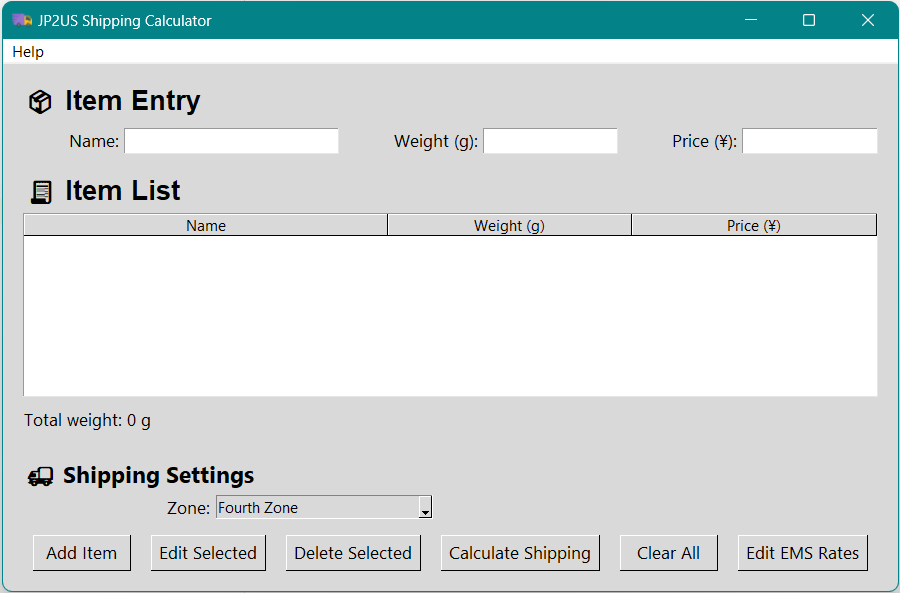
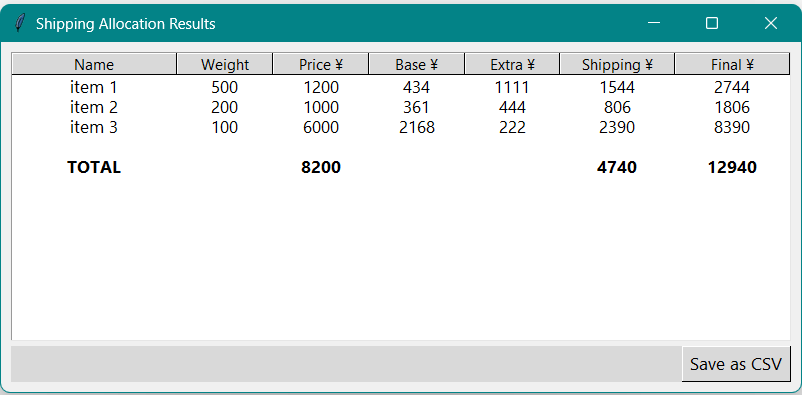
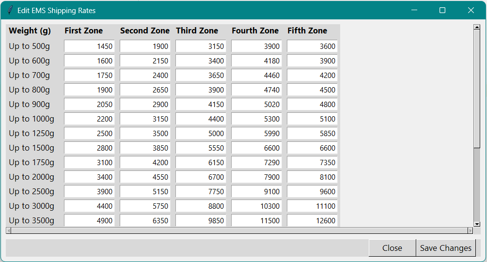

# 📦 JP2US Shipping Calculator

**A desktop app to fairly allocate international shipping costs from Japan to the US.**  
This tool is designed to help buyers who purchase multiple items online from Japan and ship them together using EMS.

---

## ✨ Features

- 🧮 **Hybrid cost allocation strategy**:
  - Base fee (first 500g) is distributed by item value
  - Incremental fee (after 500g) is distributed by item weight
- 📦 Add items with name, weight, and price
- 📝 View, edit, delete items in a dynamic table
- 🚚 Choose EMS shipping zone
- 📊 Get per-item shipping breakdown and total cost
- 🛠 Edit EMS rate table (in-session only)
- 📤 Export results to CSV
- 🧹 Clear all items with one click
- 📎 Responsive layout with clean UI
- 📌 Packaged as a `.exe` for Windows — no install required!

---

## 📥 Download

> 🪟 [Download Windows exe](https://github.com/nathankong97/jp2us-shipcalc/releases/download/v1.0.0/JP2US-Shipping-Calculator.zip)

Just double-click to launch — no installation required.

---

## 📸 Screenshots

| Main UI | Allocation Results | EMS Rate Editor |
|--------|--------------------|-----------------|
|  |||

---

## 📂 Folder Structure
```text
jp2us-shipcalc/ 
├── assets/ # App icons 
├── dist/ # Final packaged app (Windows .exe) 
├── src/ 
│ ├── main.py # Entry point 
│ ├── ui/ # UI components (app_ui, popups) 
│ ├── model/ # Business logic (shipping calc, rate tables) 
│ └── controller/ # App logic (item mgmt, UI control) 
└── README.md
```

---

## 🚀 Packaging (for developers)

> Build a Windows `.exe` with [PyInstaller](https://pyinstaller.org):
```bash
pip install pyinstaller
python -m PyInstaller --noconsole --onefile --icon=assets/favicon.ico src/main.py
```
Packaged `.exe` will be located in the `dist/` folder.

---

## 📌 Notes
- All EMS rate edits are in-session only (reset on app restart)
- Tested on Windows 10/11 with Python 3.10+

---

## 🗺️ Future Roadmap
 - macOS .app packaging
 - DHL/other carrier support
 - Save/load item lists (JSON)
 - Currency conversion
 - Chart-based cost breakdown
